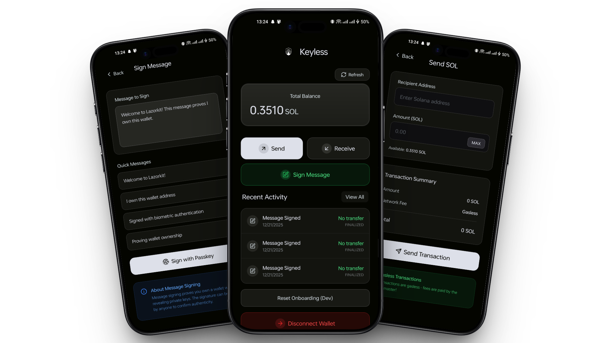

# Lazorkit Keyless Wallet - React Native Example



## Project Overview

This repository provides a **production-ready example** of integrating Lazorkit SDK into a React Native mobile app. It demonstrates how to eliminate traditional crypto wallet friction by implementing:

- **Passkey Authentication** - Users create wallets with fingerprint/Face ID (no seed phrases)
- **Gasless Transactions** - Send SOL without paying network fees
- **Smart Wallet Integration** - Solana Program Derived Addresses controlled by passkeys
- **Cross-Device Sync** - Passkeys work across all user devices automatically

**Perfect for:** Developers wanting to add crypto functionality to existing apps without forcing users to download separate wallet apps.

## 🚀 Try the Live Demo

**[📲 Download APK](https://github.com/exyness/lazorkit-keyless/releases/latest/download/lazorkit-keyless-wallet-v1.0.0.apk)**

Experience the app instantly on your Android device:
1. Download and install the APK
2. Create wallet with your fingerprint  
3. Get free test SOL from built-in faucet
4. Send gasless transactions to friends

*Requires Android device with biometric authentication*

## Quick Start

### Prerequisites
- Node.js 18+ and Bun package manager
- Android Studio (for Android development)
- Physical Android device (passkeys require real hardware)

### Installation & Setup

```bash
# Clone the repository
git clone https://github.com/exyness/lazorkit-keyless.git
cd lazorkit-keyless

# Install dependencies
bun install

# Configure Android SDK path
echo "sdk.dir=YOUR_ANDROID_SDK_PATH" > android/local.properties

# Build and install on device
cd android
./gradlew assembleDebug
adb install app/build/outputs/apk/debug/app-debug.apk
```

### Environment Configuration

The app is pre-configured for Solana Devnet testing:

```typescript
// Already configured in App.tsx
<LazorKitProvider
  rpcUrl="https://api.devnet.solana.com"
  portalUrl="https://portal.lazor.sh"
  configPaymaster={{
    paymasterUrl: "https://kora.devnet.lazorkit.com"
  }}
>
```

### Running the Example

1. **Install APK** on your Android device
2. **Open the app** - you'll see the onboarding flow
3. **Create wallet** - tap "Create Account" and use your fingerprint
4. **Get test SOL** - use the built-in faucet integration
5. **Try features** - send money, receive via QR codes, sign messages

## Step-by-Step Tutorials

### Tutorial 1: [Passkey-Based Wallet Creation](docs/TUTORIAL_1.md)
Learn how to implement fingerprint/Face ID wallet creation that eliminates seed phrases:
- Setting up Lazorkit provider
- Implementing passkey authentication flow
- Understanding smart wallet addresses
- Session persistence across app restarts

### Tutorial 2: [Gasless Transactions & Wallet Features](docs/TUTORIAL_2.md)
Build essential wallet functionality with zero transaction fees:
- Checking wallet balances from Solana blockchain
- Sending SOL with gasless transactions
- Generating QR codes for receiving payments
- Displaying transaction history

### Tutorial 3: [Gasless Transactions Deep Dive](docs/TUTORIAL_3.md)
Master advanced paymaster features for seamless UX:
- Understanding paymaster sponsorship
- Alternative fee tokens (pay with USDC)
- Transaction batching and optimization
- Error handling and rate limiting

### Tutorial 4: [Message Signing & Authentication](docs/TUTORIAL_4.md)
Implement secure authentication without passwords:
- Cryptographic message signing with passkeys
- Wallet ownership verification
- Login systems using signed messages
- Off-chain authentication patterns

## Code Structure

```
src/
├── screens/                 # Main app screens
│   ├── OnboardingScreen.tsx    # 4-step user education flow
│   ├── WalletScreen.tsx        # Main dashboard with balance/actions
│   ├── SendScreen.tsx          # Gasless SOL transfer interface
│   ├── ReceiveScreen.tsx       # QR code generation for payments
│   ├── SignMessageScreen.tsx   # Message signing for auth
│   └── TransactionHistoryScreen.tsx # Blockchain transaction history
├── styles/                  # Styled components and themes
└── components/             # Reusable UI components
```

## Key Features Demonstrated

### 1. Passkey Authentication
```typescript
// From src/screens/OnboardingScreen.tsx
const handleCreateWallet = async (type: 'create' | 'login') => {
  await connect({
    redirectUrl: APP_SCHEME,
    onSuccess: (walletInfo) => {
      console.log('Wallet created:', walletInfo.smartWallet);
      onComplete();
    },
    onFail: (error) => {
      console.error('Wallet creation failed:', error);
    },
  });
};
```

### 2. Gasless Transactions
```typescript
// From src/screens/SendScreen.tsx
const signature = await signAndSendTransaction(
  {
    instructions: [transferInstruction],
    transactionOptions: {
      feeToken: 'SOL',
      clusterSimulation: 'devnet',
    },
  },
  {
    redirectUrl: APP_SCHEME,
    onSuccess: (sig) => console.log('Transaction sent:', sig),
    onFail: (error) => console.error('Transaction failed:', error),
  }
);
```

### 3. Smart Wallet Integration
```typescript
// From src/screens/WalletScreen.tsx
const walletAddress = smartWalletPubkey?.toString() || '';

// Use for balance queries, transaction history, receiving payments
const connection = new Connection(RPC_URL, 'confirmed');
const balance = await connection.getBalance(smartWalletPubkey);
```

## UI/UX Highlights

- **Glass morphism design** - Modern, clean interface
- **Smooth animations** - Page transitions and loading states
- **Biometric integration** - Native fingerprint/Face ID prompts
- **QR code generation** - Easy payment receiving
- **Transaction feedback** - Clear success/error states

## Testing & Development

### Testing on Physical Devices
```bash
# Build release APK for testing
cd android && ./gradlew assembleRelease

# Install on device
adb install app/build/outputs/apk/release/app-release.apk
```

### Getting Test SOL
The app includes integration with Solana faucet for easy testing:
1. Navigate to Receive screen
2. Tap "Get Free SOL" 
3. Complete captcha on faucet website
4. Receive 1-2 test SOL in ~30 seconds

### Common Testing Scenarios
- First-time user onboarding flow
- Returning user automatic connection
- Gasless transaction execution
- Cross-device passkey sync
- Network error handling

## Security Features

- **Hardware-backed passkeys** - Keys stored in secure enclave
- **No seed phrase management** - Eliminates user error risk
- **Biometric authentication** - Required for all transactions
- **Input validation** - Address and amount verification
- **Rate limiting** - Prevents transaction spam

## Live Demo

**Devnet Demo:** [Download APK](https://github.com/exyness/lazorkit-keyless-wallet/releases)

**Try it yourself:**
1. Download and install APK on Android device
2. Complete onboarding with your fingerprint
3. Get test SOL from integrated faucet
4. Send gasless transactions to friends
5. Experience the future of crypto UX!

## Integration Guide

### Adding to Existing App

1. **Install Lazorkit SDK:**
```bash
bun add @lazorkit/wallet-mobile-adapter
```

2. **Wrap your app:**
```typescript
import { LazorKitProvider } from '@lazorkit/wallet-mobile-adapter';

export default function App() {
  return (
    <LazorKitProvider
      rpcUrl="https://api.devnet.solana.com"
      portalUrl="https://portal.lazor.sh"
      configPaymaster={{ paymasterUrl: "https://kora.devnet.lazorkit.com" }}
    >
      <YourExistingApp />
    </LazorKitProvider>
  );
}
```

3. **Use wallet hooks:**
```typescript
import { useWallet } from '@lazorkit/wallet-mobile-adapter';

function YourComponent() {
  const { connect, isConnected, smartWalletPubkey } = useWallet();
  // Your integration logic here
}
```

## Contributing

This example is designed to be a learning resource. Feel free to:
- Fork and customize for your use case
- Submit issues for bugs or unclear documentation
- Propose improvements to the tutorials
- Share your own integration examples

## Support & Resources

- **Lazorkit Docs:** [docs.lazorkit.com](https://docs.lazorkit.com/)
- **Telegram Community:** [t.me/lazorkit](https://t.me/lazorkit)
- **GitHub Repository:** [github.com/lazor-kit/lazor-kit](https://github.com/lazor-kit/lazor-kit)

## License

This project is licensed under the MIT License - see the [LICENSE](LICENSE) file for details.

---

**Built by:** exyness  
**Version:** 1.4.1  
**Lazorkit SDK:** Latest  
**Framework:** React Native (Expo)  

*This example demonstrates the future of crypto UX - where users never need to download wallet apps, remember seed phrases, or pay transaction fees.*
